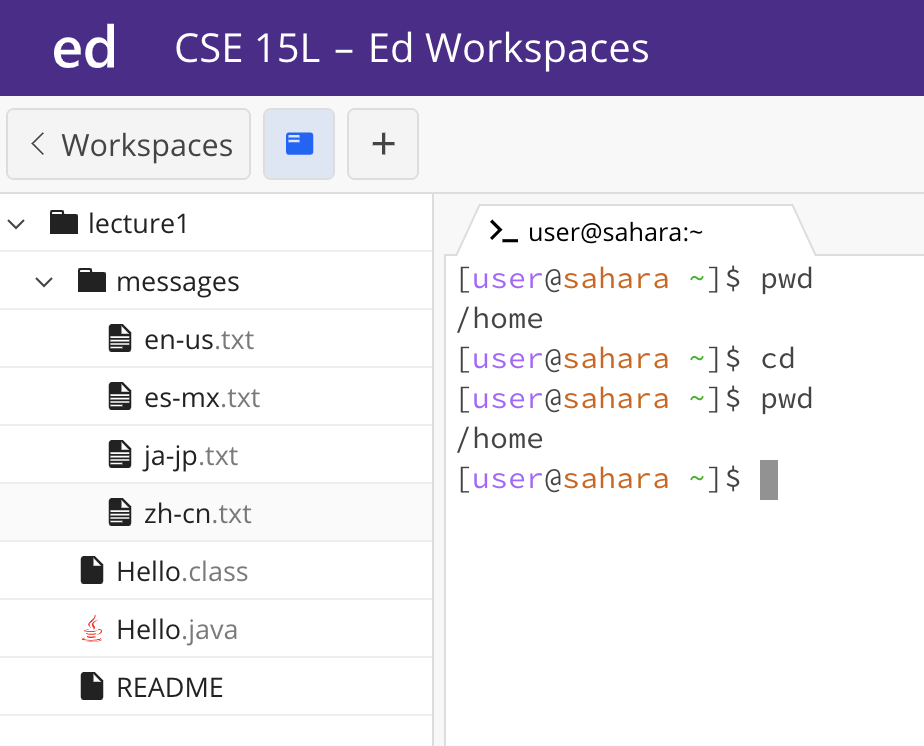

## Lab Report 1

### CD
1. **No Argument **
 
When we put no argument after cd the working directory does not change. The file system did not since we are not adding anything new, and the working directory did not change as well because no argument entry after cd commands. This is not an error because since we are not asking the system to change directory to a new location, the working directory should not change. 
2. **Path to a Directory **
3. **Path to a File **
### LS
1. **No Argument **
2. **Path to a Directory **
3. **Path to a File **
### CAT
1. **No Argument **
2. **Path to a Directory **
3. **Path to a File **
