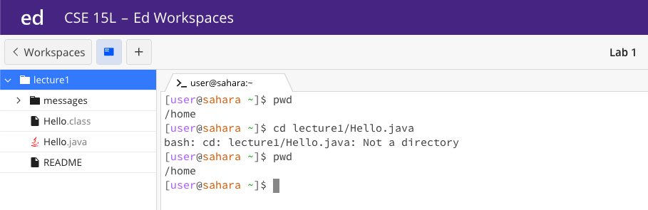

## Lab Report 1

### CD
1. **No Argument **
    
   When we put no argument after cd the working directory does not change. The file system did not since we are not adding anything new, and the working directory did not change as well because no argument entry after cd commands. This is not an error because since we are not asking the system to change directory to a new location, the working directory should not change. 
2. **Path to a Directory **
    
   When we put a path to a directory after cd command, the system's working directory will change to the directory that we put in the command line as shown above. The working directory changed from /home to /home/lecutre1/messages. The reason we got the output is becuase we changed the directory to a new location. The output is not an error. 
3. **Path to a File **
    
   When we put a path to a file after cd command, the system's working directory did not change. The reason we got the output is because cd is a command to change directory, so if we put in a path to a non-directory location, there would be an error, and the working directory will not change. I would consider this an error because we entered a location that is not a directory to cd, and the system does not know what to do to this command. 
### LS
1. **No Argument **
    
3. **Path to a Directory **
    
5. **Path to a File **
    
### CAT
1. **No Argument **
2. **Path to a Directory **
3. **Path to a File **
