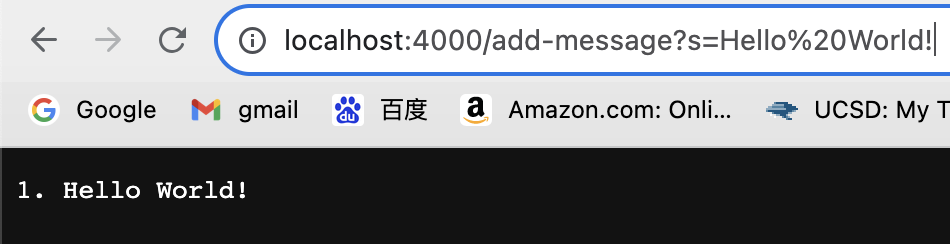

## Lab Report 2
Yutong Guo<br>
A16269813<br>
### PART 1
CODE
``` {java}
import java.io.IOException;
import java.net.URI;
import java.util.ArrayList;
import java.util.List;

class Handler implements URLHandler {
    private final List<String> messages = new ArrayList<>();

    @Override
    public String handleRequest(URI url) {
        if (url.getPath().equals("/")) {
            return "Hello, here are the list of items stored: " + String.join("\n", messages);
        } else if (url.getPath().contains("/add-message")) {
            String query = url.getQuery();
            if (query != null && query.startsWith("s=")) {
                String newMessage = query.substring(2);
                messages.add((messages.size() + 1) + ". " + newMessage);
                return String.join("\n", messages);
            } else {
                return "Invalid request!";
            }
        } else {
            return "404 Not Found!";
        }
    }
}

public class StringServer {
    public static void main(String[] args) throws IOException {
        if(args.length == 0){
            System.out.println("Missing port number! Try any number between 1024 to 49151");
            return;
        }

        int port = Integer.parseInt(args[0]);

        Server.start(port, new Handler());
    }
}
```
<br>
To start the server, the StringServer method is called, and we start a local server. Then, in the screenshot above, we are calling the handleRequest method. The relevant argument to the methods is the URL. The relevant values is the path by the end of the URL, here our path contains ```/add-message```, so we go into the ```else if``` statement and the values is the string after ```s=```, which in this case is ```Hello World!```. The relevant value change during this command is the array list ```List<String> messages``` it was empty and after this command was run, there is one item in it, which is ```1. Hello World!```. ```\n``` was not added because we took care of that when we are returning the string.

