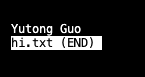

## Lab Report 3
Yutong Guo<br>
A16269813<br>
### PART 1
The reverseInPlace method in the Array methods.
1. A failure-inducing input would be:
   ``` {java}
   @Test
   public void testReverseInPlace2() {
    int[] input1 = { 3, 4, 5 };
    ArrayExamples.reverseInPlace(input1);
    assertArrayEquals(new int[]{ 5, 4, 3 }, input1);
   }
   ```
2. A code that does not induce failure:
   ```{java}
   @Test
   public void testReverseInPlace() {
    int[] input1 = { 3 };
    ArrayExamples.reverseInPlace(input1);
    assertArrayEquals(new int[]{ 3 }, input1);
   }
   ```
3. The symptom:
   <br>

4. The bug: <br>
   Before:
   ```{java}
   static void reverseInPlace(int[] arr) {
    for(int i = 0; i < arr.length; i += 1) {
      arr[i] = arr[arr.length - i - 1];
    }
   }
   ```
   
   After:
   ```{java}
   static void reverseInPlace(int[] arr) {
    for(int i = 0; i < arr.length / 2; i++) {
        int temp = arr[i];
        arr[i] = arr[arr.length - i - 1];
        arr[arr.length - i - 1] = temp;
    }
   }
   ```
   <br>
   The original bug is because the array is dynamically changing as we are setting the second half of the array equal to their original value because we set the first part of the array equal to the second half, so when we reach the second half of the array, the data was overwritten and we lost the data of the first half of the array.
### PART 2
We will explore the command ```less```. Here I will explore 4 different command line options.
1. -E <br>
   By using this command line option, ```less``` automatically exits upon reaching the end of the file. This is pretty easy to understand, here are two examples:<br>
   
   Example 1:<br>
   <br>
   Hi.txt is a file I created according to the instructions at the end of the lab, it includes only one line. Here since there is only one line in the file, using less -E will instantly exit without even showing the viewer the content of the file. So when the file is short, I would not recommend using this command line option, but I can see how it is useful when we are reading a longer file. <br>

   Example 2:<br>
   <video src="https://github.com/Y3GUO/cse15l-lab-reports/assets/122977555/2cb94841-671f-429e-8df0-49adfc0a410c" controls="controls" style="max-width: 730px;">
   </video>
   Here we can see that when we use less -E on a longer txt file, when we scroll to the end, we will automatically exit to the terminal without needing to press ```q```. Since the pdf does not support video, the original video can also be found using this [LINK](https://github.com/Y3GUO/cse15l-lab-reports/assets/122977555/2cb94841-671f-429e-8df0-49adfc0a410c).
2. -f <br>
   By using this comman line option, ```less``` will force to open non-regular files like a directory or a device-special file.<br>
   
   Example 1:<br>
   <br>
   Hi.txt is a file I created according to the instructions at the end of the lab, it includes only one line. Using the command line option ```less -f``` on the file will give us an output that is the same as using ```less```, as shown above.<br>

   Example 2:<br>
   

