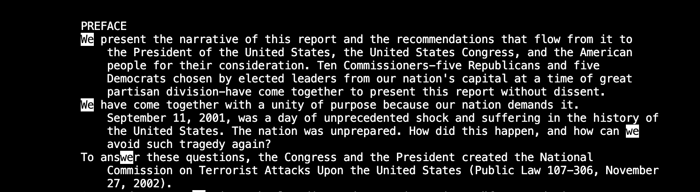
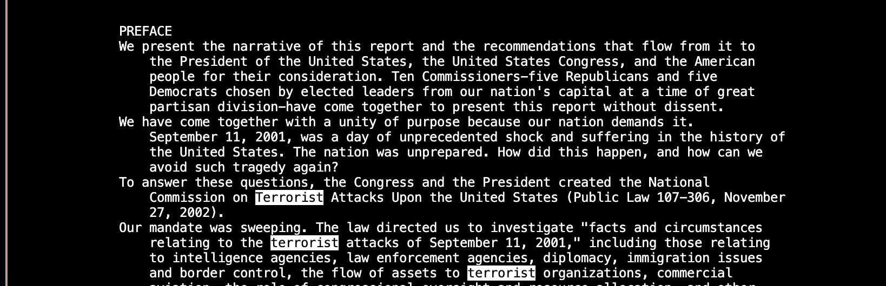

## Lab Report 3
Yutong Guo<br>
A16269813<br>
### PART 1
The reverseInPlace method in the Array methods.
1. A failure-inducing input would be:
   ``` {java}
   @Test
   public void testReverseInPlace2() {
    int[] input1 = { 3, 4, 5 };
    ArrayExamples.reverseInPlace(input1);
    assertArrayEquals(new int[]{ 5, 4, 3 }, input1);
   }
   ```
2. A code that does not induce failure:
   ```{java}
   @Test
   public void testReverseInPlace() {
    int[] input1 = { 3 };
    ArrayExamples.reverseInPlace(input1);
    assertArrayEquals(new int[]{ 3 }, input1);
   }
   ```
3. The symptom:
   <br>

4. The bug: <br>
   Before:
   ```{java}
   static void reverseInPlace(int[] arr) {
    for(int i = 0; i < arr.length; i += 1) {
      arr[i] = arr[arr.length - i - 1];
    }
   }
   ```
   
   After:
   ```{java}
   static void reverseInPlace(int[] arr) {
    for(int i = 0; i < arr.length / 2; i++) {
        int temp = arr[i];
        arr[i] = arr[arr.length - i - 1];
        arr[arr.length - i - 1] = temp;
    }
   }
   ```
   <br>
   The original bug is because the array is dynamically changing as we are setting the second half of the array equal to their original value because we set the first part of the array equal to the second half, so when we reach the second half of the array, the data was overwritten and we lost the data of the first half of the array.
### PART 2
We will explore the command ```less```. Here I will explore 4 different command line options.
1. ```-E``` <br>
   By using this command line option, ```less``` automatically exits upon reaching the end of the file. This is pretty easy to understand, here are two examples:<br>
   
   Example 1:<br>
   ```
   (base) tonyguo@Yutongs-MacBook-Pro technical % less -E hi.txt 
   ```
   Hi.txt is a file I created according to the instructions at the end of the lab, it includes only one line. Here since there is only one line in the file, using less -E will instantly exit without even showing the viewer the content of the file. So when the file is short, I would not recommend using this command line option, but I can see how it is useful when we are reading a longer file. <br>

   Example 2:<br>
   ```
   (base) tonyguo@Yutongs-MacBook-Pro 911report % less -E preface.txt
   ```
   Here we can see that when we use less -E on a longer txt file, when we scroll to the end, we will automatically exit to the terminal without needing to press ```q```. Since the pdf does not support video, the original video can also be found using this [LINK](https://github.com/Y3GUO/cse15l-lab-reports/assets/122977555/2cb94841-671f-429e-8df0-49adfc0a410c).<br>
   **Source: This command line option is found by using google search prompt "less command line options". Here is a [LINK](https://phoenixnap.com/kb/less-command-in-linux) to the website.**
3. ```-f``` <br>
   By using this comman line option, ```less``` will force to open non-regular files like a directory or a device-special file.<br>
   
   Example 1:<br>
   <br>
   Hi.txt is a file I created according to the instructions at the end of the lab, it includes only one line. Using the command line option ```less -f``` on the file will give us an output that is the same as using ```less```, as shown above.<br>

   Example 2:<br>
   <br>
   <br>
   Here we are first using ```less``` on the directory 911report, which gives us an error: ```911report is a directory```. Then when we use ```less -f``` on the same directory 911report, the less command will be forced to run and no error will be produced, although the content read from ```less``` is an error message, I can see this being useful when we are writing bash scripts, where sometimes we do not want an error message to interrupt the run of other commands. <br>
   **Source: This command line option is found by using google search prompt "less command line options". Here is a [LINK](https://phoenixnap.com/kb/less-command-in-linux) to the website.**

4. ```/[string]``` <br>
   ```/[string]``` is not a command line option, but it is a useful keyboard shortcut that we can use. This shortcut will search and highlight all the matching strings, and search forward. <br>

   Example 1:<br>
   <br>
   Here we are first using ```less``` on the file preface.txt in 911report directory, then when we use the keyboard shortcut ```/We```. All matching ```We``` are highlighted and our view jumps to the first occurrence of ```We```.<br>
   
   Example 2:<br>
   <br>
   Similarly, here we are first using ```less``` on the file preface.txt in 911report directory, then when we use the keyboard shortcut ```/Terrorist```. All matching ```Terrorist```is highlighted, in this case, there is only one occurrence, and our view jumps to the first occurrence of ```Terrorist```, as shown by the first line includes the highlighted word ```Terrorist```.<br>
   **Source: This keyboard shortcut is found by using google search prompt "less command line options". Here is a [LINK](https://phoenixnap.com/kb/less-command-in-linux) to the website.**
5. ```-g``` <br>
   This command line option has a very interesting interaction with the keyboard shortcut ```/[string]``` above. Remember how using the shortcut ```/[string]``` will highlight all the matching strings? Using ```-g``` command line will highlight only the string last found using search.

   Example 1:<br>
   <br>
   Here we are doing a similar thing as example 1 on Number 3. The only difference is that we first use ```less -g``` command, then when we use the keyboard shortcut ```/We```. The first matching ```We``` is highlighted and our view jumps to the first occurrence of ```We```.<br>

   Example 2:<br>
   <br>
   Similarly, when we do another search for a different word after using ```less -g``` command, the first matching string is highlighted and our view jumps to the first occurrence of the string.<br>
   **Source: This command line option is found by using google search prompt "less command line options". Here is a [LINK](https://phoenixnap.com/kb/less-command-in-linux) to the website.**
