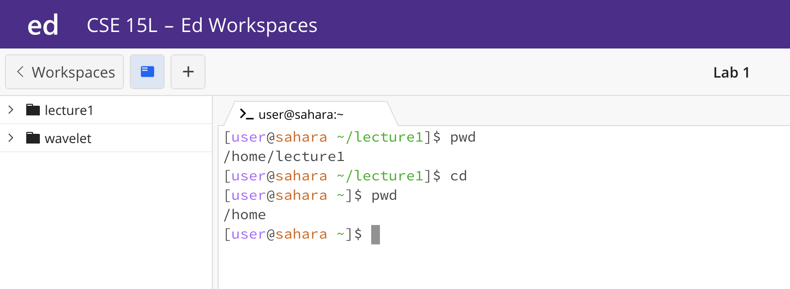

## Lab Report 1
Yutong Guo 
A16269813 
### CD
1. **No Argument **
    
   When we put no argument after cd the working directory does not change. The working directory was /home, and the working directory is still /home after the command was run.
    
   If the working directory was /home/lecture1, after the command was run, the directory goes back to /home.
   The file system automatically assumes we are changing directory to /home if we do not add any argument after the command cd. This is not an error because with no argument after cd, the system is doing something smart, which is assuming we are changing back to /home directory. 
3. **Path to a Directory **
    
   When we put a path to a directory after cd command, the system's working directory will change to the directory that we put in the command line as shown above. The working directory changed from /home to /home/lecutre1/messages. The reason we got the output is becuase we changed the directory to a new location. The output is not an error. 
4. **Path to a File **
    
   When we put a path to a file after cd command, the system's working directory did not change. The working directory was /home, and the working directory is still /home after the command was run. The reason we got the output is because cd is a command to change directory, so if we put in a path to a non-directory location, there would be an error, and the working directory will not change. I would consider this an error because we entered a location that is not a directory to cd, and the system does not know what to do to this command. 
### LS
1. **No Argument **
    
   When we put no argument after ls, the working directory does not change, the working directory was /home, and the working directory is still /home after the command was run. The system will list all the elements in the current directory. For example, in the figure above, when we type ls while the working directory is /home, the system lists lecture1, which is the only element under /home. This is not an error, because ls will not change the working directory, and ls listed all the under working directory. 
2. **Path to a Directory **
    
   When we put a path to a directory after ls command, the working directory does not change. The working directory was /home, and the working directory is still /home after the command was run. The system will list all the elements under the directory that was provided. For example, in the figure above, when we type ls with the path to lecture1/messages, the system lists all files in messages. This is not an error, because ls will not change the working directory, and ls listed all the under the directory we entered. 
3. **Path to a File **
    
   When we put a path to a file after ls command, the working directory does not change. The working directory was /home, and the working directory is still /home after the command was run. The system will list the path to the file we entered. For Example, in the figure above when we put the path to Hello.java file after ls, the system outputs the same path to Hello.java file. This is not an error, because ls will not change the working directory.
### CAT
1. **No Argument **
    
    When we put no argument after cat, the working directory does not change. The working directory was /home, and the working directory is still /home after the command was run. The system will wait for new inputs to concatenate and display. For example, in the figure above, if we enter any new characters or strings, the system will display the entered strings, but if we do not enter anything, the system will just wait for new input and need to force quit out of the command. I would not consider this as an error because the system is waiting for new input to display and the working directory does not change. 
2. **Path to a Directory **
    
   If we put a path to a directory after cat command, the working directory does not change. The working directory was /home, and the working directory is still /home after the command was run. An error message is displayed. For example, in the figure above, when we put a path to a directory after the cat command, the system outputs "XXX; Is a directory". The system cannot concat and display directories, only files. So here we are encountering an error as a path to a directory is an invalid argument input for the command cat. 
3. **Path to a File **
    
   If we put a path to a file after cat command, the working directory does not change. The working directory was /home, and the working directory is still /home after the command was run. The content of the file is displayed. For example, in the figure above, when we put the path to Hello.java, the content of Hello.java is displayed. This is not an error, as the main function is achieved by putting a path to one or multiple files after the cat command.
