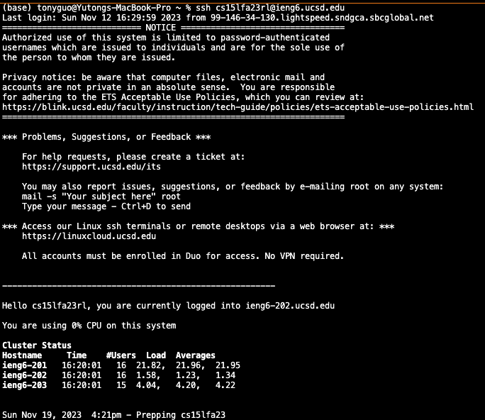
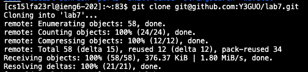

## Lab Report 4
Yutong Guo 
A16269813 
### Step 1
 
Keys pressed: `Command-V` `<Enter>`. Since the ssh command I had already copied to my clipboard before starting the timer, I just pasted the command in and pressed enter to run. 
### Step 2
 
Keys pressed: git`<space>`clone`<space>` `Command-V`. Before taking this step, I navigated to the GitHub repo that I forked and pressed the copy button under the Code->ssh section. The paste command will directly paste the ssh link.
### Step 3
