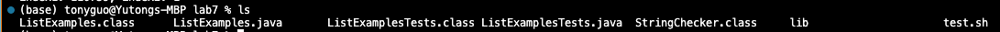

## Lab Report 4
Yutong Guo<br>
A16269813<br>
### Part 1
1. **Original Post**:
Title: Issue with `ListExamples.merge` Method Not Merging Lists Correctly
Hey, I'm working on this `ListExamples` class, specifically the merge method. It's supposed to merge two sorted lists into a single sorted list. However, I'm running into an issue where the method doesn't seem to be merging the lists correctly. Here's a screenshot of my test case and the output:<br>
**Test**:<br>
<br>
**Result**:<br>
<br>
For the first test, it merges lists with elements ["x", "y"] and ["a", "b"] just fine. However, when it tries to merge ["a", "b", "c"] with ["c", "d", "e"], it gives us a 500 ms timeout.<br>
I'm guessing there's an issue when both lists contain a common element, which in our case is "c". This might be causing the merge function to enter an infinite loop. Has anyone encountered a similar problem or can spot where the error might be happening in the merge method?<br>
2. **TA's Response**:<br>
Hello,<br>
Great job on setting up your test cases and noticing the timeout during the second test. The fact that testMerge2 is timing out is indeed indicative of an infinite loop. Given that your first test passes but the second fails, we should look closely at what differs between the two scenarios.<br>
You’ve made a good observation regarding the common element "c" in both lists for testMerge2. In a merge operation, it's critical that each element is only processed once, even if it appears in both lists. If the code mistakenly continues to compare the same pair of elements without moving forward, it could result in an infinite loop.<br>
Could you insert a few print statements inside the merge method to print out the values of index1 and index2 before and after you expect them to change? Like: `System.out.println("index1: " + index1 + ", index2: " + index2);`. This will help you solve the problem, feel free to reach out for more questions!
3. **Code after advice**:<br>
<br>
This is what I got from implementing the print statement. I think it is pretty clear what the bug is. The index values index1 and index2 both increase initially, but then `index1` continues to increment without `index2` ever advancing past 1. So the bug is `index1` is incrementing in the while loop that is intended to iterate through `list2`. This causes an infinite loop because `index2`, which controls the iteration over `list2`, never increases past 1, and therefore the condition `ndex2 < list2.size()` remains true, preventing the loop from terminating.
4. **Information about the setup**:
- The file & directory structure:<br>
<br>
I have one directory called lab 7, all java files and bash script are located inside this directory.<br>
<br>
There is one directory inside lab 7 called lib, which contains the files needed for junit tests to be setup. 
- The contents of each file before fixing the bug:
  - ListExamples.java:
    
    ```
    import java.util.ArrayList;
    import java.util.List;

    interface StringChecker { boolean checkString(String s); }

    class ListExamples {

      static List<String> merge(List<String> list1, List<String> list2) {
    List<String> result = new ArrayList<>();
    int index1 = 0, index2 = 0;
    while(index1 < list1.size() && index2 < list2.size()) {
      System.out.println("index1: " + index1 + ", index2: " + index2);
      if(list1.get(index1).compareTo(list2.get(index2)) < 0) {
        result.add(list1.get(index1));
        index1 += 1;
      }
      else {
        result.add(list2.get(index2));
        index2 += 1;
      }
    }
    while(index1 < list1.size()) {
      result.add(list1.get(index1));
      index1 += 1;
    }
    while(index2 < list2.size()) {
      System.out.println("index1: " + index1 + ", index2: " + index2);
      result.add(list2.get(index2));
      index2 += 1;
    }
    return result;
    }
    }
    ```
  - ListExamplesTest.java
    
    ```
    import static org.junit.Assert.*;
    import org.junit.*;
    import java.util.*;
    import java.util.ArrayList;


    public class ListExamplesTests {
	@Test(timeout = 500)
	public void testMerge1() {
    		List<String> l1 = new ArrayList<String>(Arrays.asList("x", "y"));
		List<String> l2 = new ArrayList<String>(Arrays.asList("a", "b"));
		assertArrayEquals(new String[]{ "a", "b", "x", "y"}, ListExamples.merge(l1, l2).toArray());
	}
	
	@Test(timeout = 500)
        public void testMerge2() {
		List<String> l1 = new ArrayList<String>(Arrays.asList("a", "b", "c"));
		List<String> l2 = new ArrayList<String>(Arrays.asList("c", "d", "e"));
		assertArrayEquals(new String[]{ "a", "b", "c", "c", "d", "e" }, ListExamples.merge(l1, l2).toArray());
        }

    }
    ```
    
  - test.sh
    
    ```
    javac -cp .:lib/hamcrest-core-1.3.jar:lib/junit-4.13.2.jar *.java
    java -cp .:lib/hamcrest-core-1.3.jar:lib/junit-4.13.2.jar org.junit.runner.JUnitCore ListExamplesTests
    ```
    
- The full command line (or lines) you ran to trigger the bug
  The command line I ran was:
  
  ```
  bash test.sh
  ```
  
- A description of what to edit to fix the bug
  There is a type in line 44, which caused the infinite loop. We changed `index1` to `index2` and the bug was fixed.

### Part 2
During the second half of this quarter, I really enjoyed learning about Java Debugger (JDB). Learning how to set breakpoints, step through code, inspect variable values deepened my understanding of the execution flow and has significantly improved my debugging skills. Additionally, becoming more proficient with Vim has streamlined my coding process, and mastering GitHub commands via SSH has made version control and collaboration more secure and efficient.
